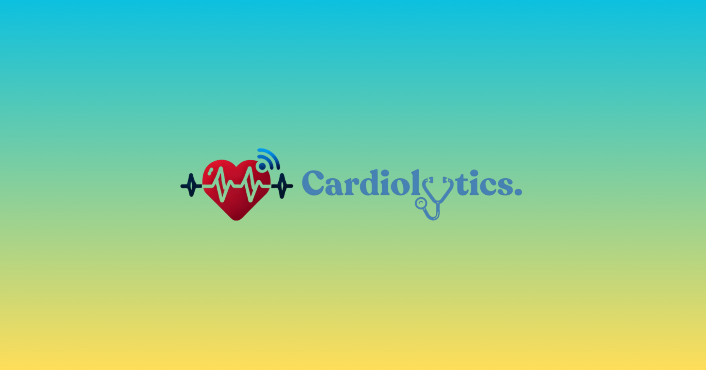
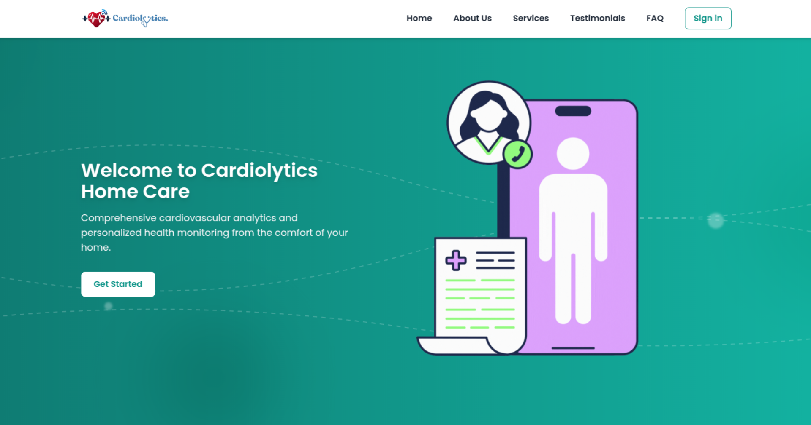
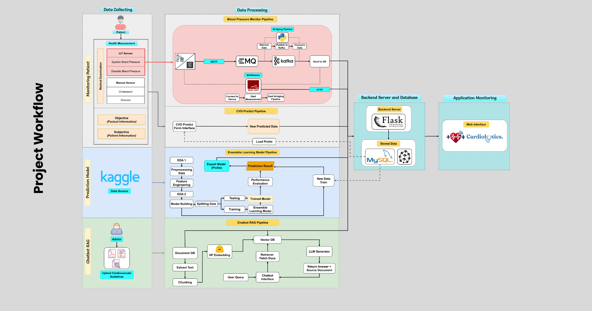

<h1 align="center">🚀 Cardiolytics Home Care</h1>

<p align="center">
  
</p>

<p align="center">
  
  
  
  
  
  
  
  
  
  
</p>

<p align="center"><b>Integrated Cardiovascular Monitoring and Prediction System</b></p>

<p align="center">
Cardiolytics is a smart and scalable web-based health monitoring system that integrates <strong>real-time IoT devices</strong>, <strong>ensemble learning models</strong>, and a <strong>document-grounded AI chatbot</strong> to support cardiovascular homecare and predictive health services.
</p>

## 🖼️ System Preview

<div align="center">
  
  <p><i>Example UI: Landing Page Cardiolytics</i></p>
</div>

## ⚙️ Key Features

✨ **Integrated Monitoring System** — End-to-end real-time health tracking with ESP32, EMQX, and Kafka.

🧠 **Hybrid ML/DL Ensemble** — Risk prediction using state-of-the-art models trained on cardiovascular data.

💬 **Document-aware Chatbot** — Answering patient questions using PDF-grounded Q\&A via Gemini and Pinecone.

👥 **Role-based Access** — Separate dashboard for Patients and Admins with secure authentication.

🛠 **Tech Stack** — Flask, Jinja, MySQL, MQTT, Node-RED, and more.

## 🚀 Quick Start

### 📁 Clone the Repository

```bash
git clone https://github.com/tmuchlissin/cardiolytics_home_care.git
cd cardiolytics_home_care
```

### 🐍 Set Up Python Environment

```bash
python3 -m venv .venv
source .venv/bin/activate
pip install -r requirements.txt          # Core Flask environment
pip install -r requirements_el.txt       # Optional: Ensemble model dependencies
```

### 📓️ Configure Database

```bash
flask db init
flask db migrate
flask db upgrade
```

### 🔌 Flash Firmware to ESP32

- Open `src/esp_simulator.ino` in Arduino IDE
- Flash to ESP32 device
- Ensure `.env` MQTT credentials are correct

### 🔁 Set Up Node-RED Flow

- Go to `http://localhost:1880`
- Import flow from `src/flows.json`

## 🖥️ Run the Application

```bash
export FLASK_APP=backend/app.py
export FLASK_ENV=development
flask run
```

🌐 Visit: [http://localhost:5000](http://localhost:5000)

## 🧽 System Architecture

<div align="center">
  
  <p><i>High-level Workflow of Cardiolytics System</i></p>
</div>

## 📝 License

This project is licensed under the [MIT License](LICENSE)
© 2025 [T. Muchlissin](https://github.com/tmuchlissin)

## 🙌 Acknowledgements

- [Flask](https://flask.palletsprojects.com/)
- [Pinecone](https://www.pinecone.io/)
- [Google Gemini](https://deepmind.google/technologies/gemini/)
- [Node-RED](https://nodered.org/)
- [ESP32](https://www.espressif.com/)

> 💬 For research collaboration or demo requests, feel free to open an issue or contact me via GitHub.
